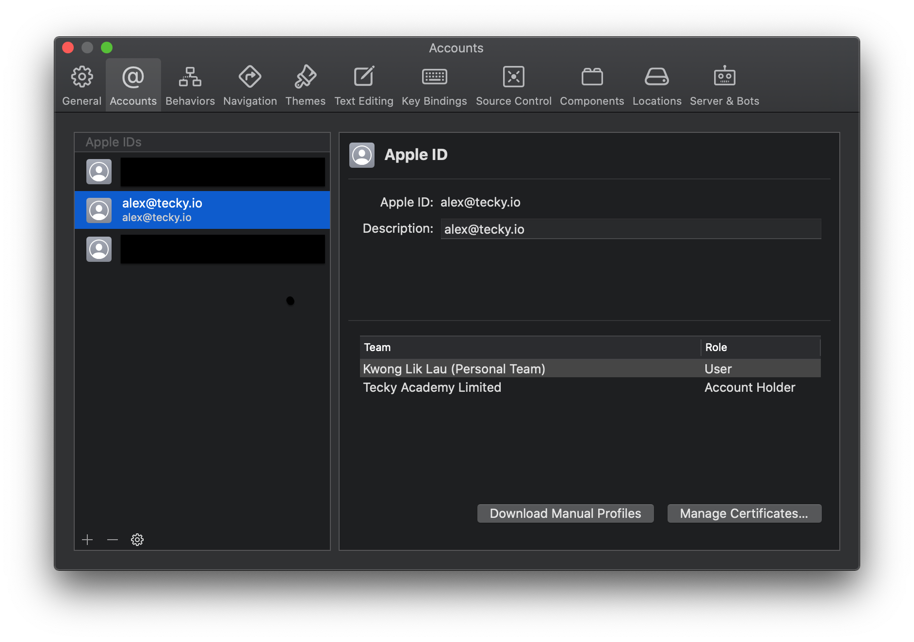

# React Native Setup

## Pre-requisite 

### iPhone users

1. You should have downloaded and installed **Xcode** already.

2. Install Homebrew https://brew.sh/

3. Install node.js and watchman

```sh
brew install node
brew install watchman
```

4. Install CocoaPods

```sh
sudo gem install cocoapods
```

5. Prepare an Apple Account which should be the same as the one you are using on your phone. Login the account in your Xcode ➡️ Preference ➡️ Accounts.



----

### Android + Mac users

1. You should have downloaded and installed **Android Studio** already.

2. Install Homebrew https://brew.sh/

3. Install node.js and watchman

```sh
brew install node
brew install watchman
```

4. Install Java SDK 8 or above

```sh
brew install --cask adoptopenjdk/openjdk/adoptopenjdk8
```

5. Start your Android Studio. Install `Android SDK Platform 29`

----

### Android + Windows users

1. You should have downloaded and installed **Android Studio** already.

2. Install node.js and Java SDK from below websites:

https://nodejs.org/en/
https://www.oracle.com/java/technologies/javase-jdk16-downloads.html

3. Start your Android Studio. Install `Android SDK Platform 29`


## Create the project

Run the react-native init command in the folder you wish to put your project in:

```sh
npx react-native init AwesomeLiPHYDemo
```

## Open the project

Use your favourite editor to modify the JavaScript source code. Then, follow below instructions to get full control of the build process without worrying the environment variables nor the command line.

### Xcode

1. Open `AwesomeLiPHYDemo/ios/AwesomeLiPHYDemo.xcworkspace` using **Xcode**

2. Click the project ➡️ Signing & Capabilities ➡️ Team: (Your Personal Apple Account)

3. Connect your iPhone and click `Run`

### Android Studio

1. Open `AwesomeLiPHYDemo/android` using **Android Studio**

2. Connect your Android and click `Run`
