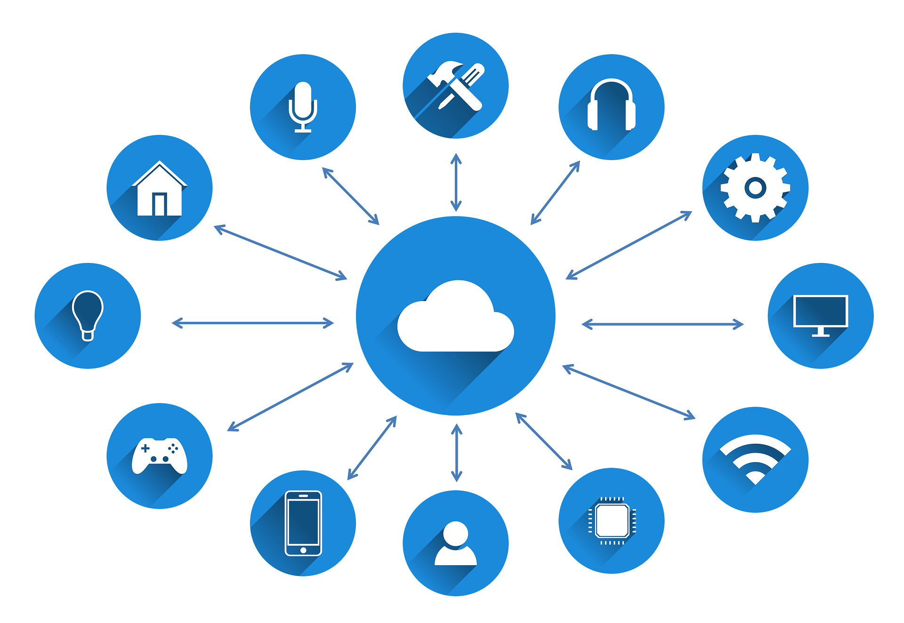
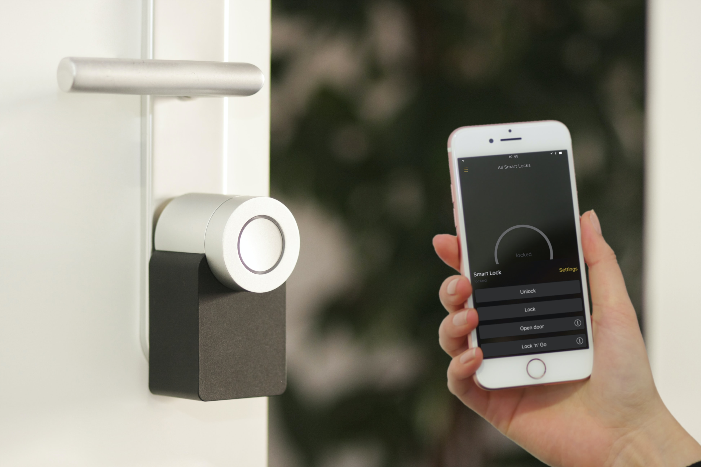
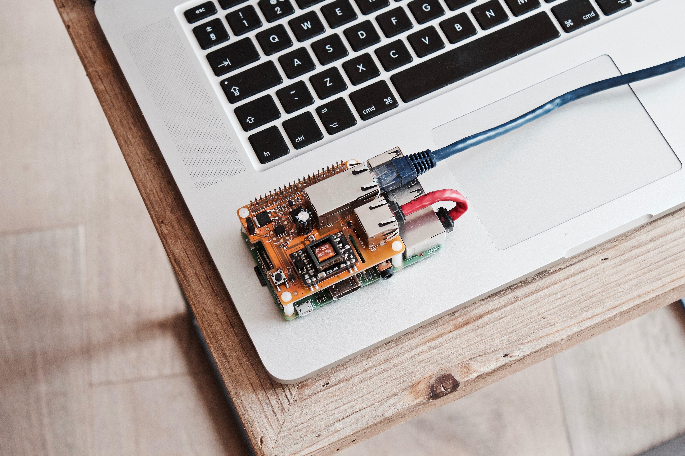

# Building your first IoT Application

## Agenda & Objective

1. Introduction to IoT applications

2. Quick way to build a cross-platform IoT application

3. LiPHY Quick Start Demo 

4. Learn a bit about React & React Native

## Why do we need a native mobile application?

## Common technologies that IoT native applications use

* Bluetooth (Bluetooth/BLE)
* Local Area Network (Wi-Fi, zeroconf)
* Voices (Microphone)
* Videos (Camera)
* Cloud

## Native App vs Cross-platform App

### Native App 

Pros

* Official support of the above common interfaces 
* Access to all available features
* Native performance

Cons

* Write everything twice
* Learn everything twice
* More costly to maintain (?)

### Cross-platform App

Pros

* Write once
* Less time consuming to build a MVP

Cons

* Performance issues
* May have to rewrite some native only modules
* No stable solution yet 

Available Choices

* 😐 PhoneGap (HTML, CSS, JS)
* 👍🏻 Flutter (Dart)
* 👍🏻👍🏻 React Native (React, CSS, JavaScript)

### Status of Cross-platform App

react-native-ble-manager

react-native-ble-plx

flutter_blue

flutter_reactive_ble

